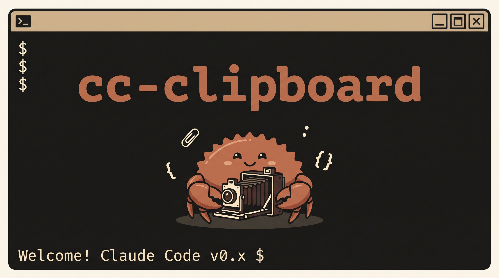

<p align="center">
  
</p>

# cc-clipboard

A lightweight Windows system tray app that captures a screen region with a drag selection, saves it as a PNG, and **automatically copies the full file path to your clipboard** — so you can paste it straight into any tool that accepts image paths (Claude Code, terminals, chat apps, etc.).

---

## Why

Sharing screenshots with tools like Claude Code requires a file path, not a raw image paste. The usual workflow is:

1. Take screenshot
2. Find the saved file
3. Copy its path
4. Paste into the terminal

cc-clipboard collapses all four steps into **one hotkey**.

---

## Features

- **Global hotkey** (`Ctrl+Shift+S`) — works from any window, even when the browser or terminal is focused
- **Drag-to-select overlay** — dims the screen, lets you drag a region; selected area is highlighted
- **Auto-save** — timestamped PNG saved to `Pictures\cc-clipboard\` automatically
- **Path to clipboard** — full path is ready to paste the moment you release the mouse
- **Toast notification** — confirms the filename after each capture
- **Open folder** — tray menu shortcut to the save folder
- **Zero runtime** — single `.exe`, no installer, no dependencies

---

## Download

Go to [Releases](../../releases) and download the latest `cc-clipboard.exe`.

> **Windows SmartScreen** may show a warning on first run since the binary is unsigned.  
> Click **"More info" → "Run anyway"** to proceed.

---

## Usage

1. Run `cc-clipboard.exe` — a small tray icon appears in the bottom-right taskbar area
2. Press `Ctrl+Shift+S` from **any window**
3. The screen dims — drag a rectangle over the area you want
4. Release the mouse — the overlay closes instantly
5. Your clipboard now contains the full path, e.g.:
   ```
   C:\Users\You\Pictures\cc-clipboard\cc_20260608_143022.png
   ```
6. Paste it anywhere

**Right-click the tray icon** for the context menu:

| Item | Action |
|---|---|
| Screenshot | Same as the hotkey |
| Open Folder | Opens the save folder in Explorer |
| Quit | Exits the app |

**Escape** or **right-click** during selection cancels without saving.

---

## Configuration

Edit `%APPDATA%\cc-clipboard\config.json` (created on first run):

```json
{
  "save_folder": "C:\\Users\\You\\Pictures\\cc-clipboard",
  "hotkey": "ctrl+shift+s",
  "notify": true
}
```

| Field | Description |
|---|---|
| `save_folder` | Where PNGs are saved |
| `hotkey` | Trigger key combo — modifiers: `ctrl`, `shift`, `alt`, `win`; key: `a`–`z`, `f1`–`f12` |
| `notify` | `true`/`false` — toggle the toast notification |

Restart the app after editing the config.

---

## Build from source

Requires [Rust](https://rustup.rs/) (stable toolchain).

```powershell
git clone https://github.com/YOUR_USERNAME/cc-clipboard
cd cc-clipboard
cargo build --release
.\target\release\cc-clipboard.exe
```

The release binary has no console window. For a debug build with console output:

```powershell
cargo run
```

---

## How it works

| Layer | Crate |
|---|---|
| Event loop | `winit 0.30` |
| System tray + menu | `tray-icon 0.21` |
| Global hotkey | `global-hotkey 0.7` |
| Screen capture | `xcap 0.2` |
| Overlay rendering | `softbuffer 0.4` |
| Clipboard | `arboard 3` |
| Toast notification | `win-toast-notify 0.1` |
| Image crop + save | `image 0.25` |

The main event loop runs on the main thread (required by Win32). When a hotkey or menu event fires, `xcap` captures the primary monitor synchronously, a fullscreen `winit` window is created as the overlay, and `softbuffer` renders the dimmed screenshot with the selection rectangle directly into a CPU framebuffer. On mouse release, the overlay closes immediately and a background thread handles the crop, save, clipboard write, and toast — so there is zero perceptible lag.

---

## License

MIT
